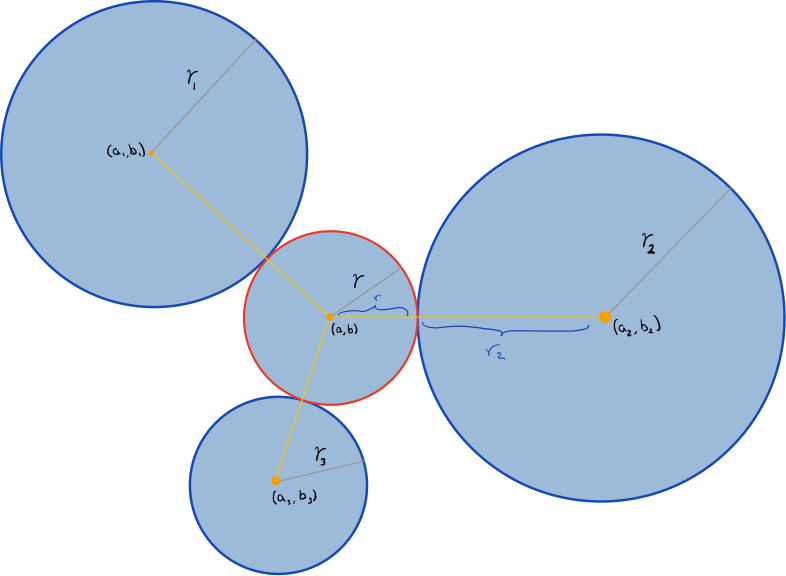

# Circles

### Finding a Circle tangent to 3 circles
In the figure below, trying to find the red cirle parameters can be thought of as imagining the center of the red circle as a point on a circle that is centered at $$(a_i,b_i)$$ with radius $r_i + r$

$$ (a - a_1)^2 + (b)
Circle Fractals

This shows
